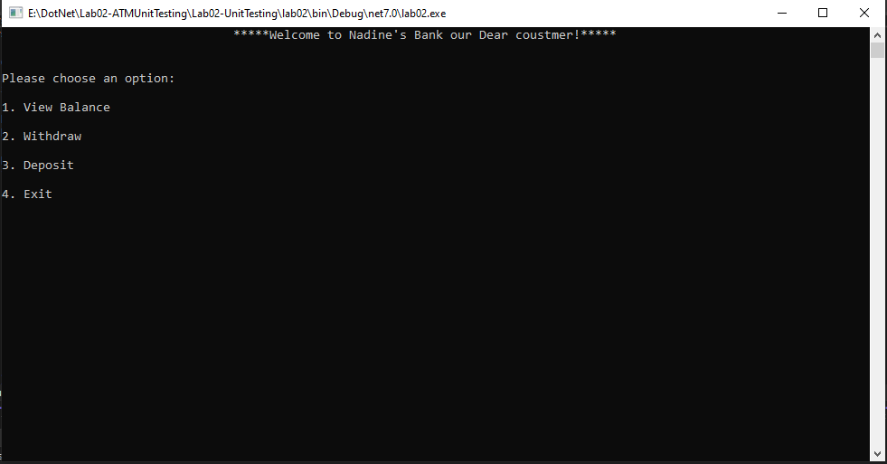
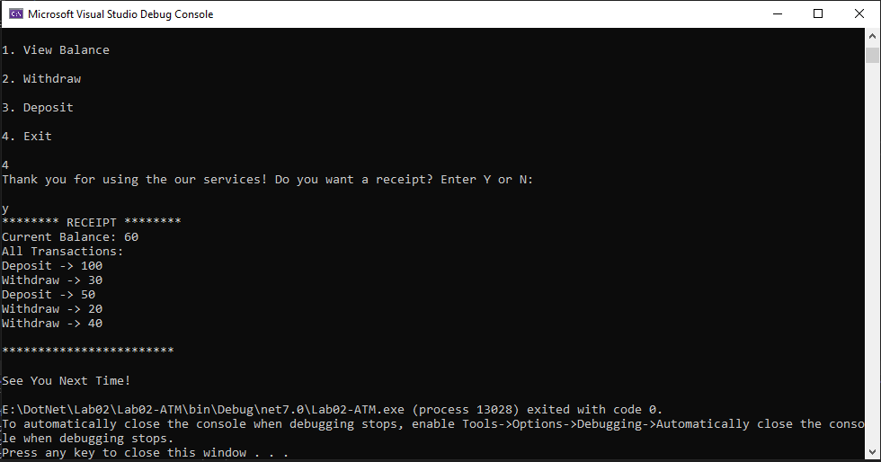

# Lab02-ATMUnitTesting

## Introduction

The ATM Console Application is a C# program that simulates the functionality of an Automated Teller Machine (ATM). It allows users to perform standard ATM operations such as checking the balance, withdrawing money, and depositing money.

## Application appearance 

## Application Features

- View Balance: Displays the current balance of the account.
- Withdraw: Allows users to withdraw money from the account. It checks for sufficient funds and does not allow withdrawing more than the available balance.
- Deposit: Allows users to deposit money into the account. It does not allow depositing a negative amount.
- Transaction Recording: Records each transaction made by the user.
- Receipt Generation: Generates a receipt at the end of the session, showing the list of transactions and the final balance.

## How to use it

1. Clone the repository or download the source code.

2. Open the solution in Visual Studio or your preferred C# development environment.

3. Build the solution to ensure all dependencies are resolved.

4. Run the application.

5. The application will display a menu with options. Follow the on-screen instructions to perform the desired operation.

6. To view the current balance, select option 1 from the menu.

7. To withdraw money, select option 2 and enter the amount to withdraw when prompted.

8. To deposit money, select option 3 and enter the amount to deposit when prompted.

9. To exit the application, select option 4.

10. A question will ask you if you want a recipt, you should enter (y) to generated a receipt, displaying the list of transactions and the final balance. or if you don't want receipt enter (n) .

11. You can run unit tests by opening the test project in Visual Studio and running the tests from Viwe -> test explorer.

## Other Detalis

- Invalid amounts will prompt an error message; such as Only positive amounts are allowed with withdrawing depositing, and withdraw amount not allwoed to be zero.

- The program Will not allow withdraw money if the account balance is zero does. Also it not allow the account balance to go below zero; If a withdrawal exceeds the available balance, an error message will be displayed.

- The program uses a static `Balance` variable to hold the account balance, which allows accessing the balance anywhere within the program.

- The program also stores the transaction details in a list and generates a receipt at the end of the session to provide a record of all transactions made if the user wanted that.
  
- The unit tests cover various scenarios for each method to ensure the accurcy and functionality is working as expected.

